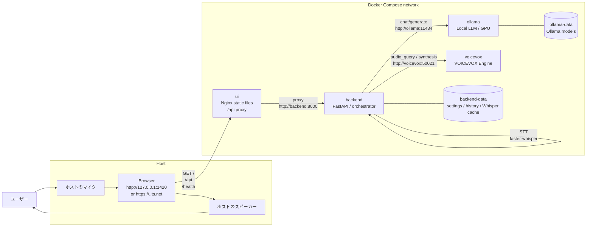
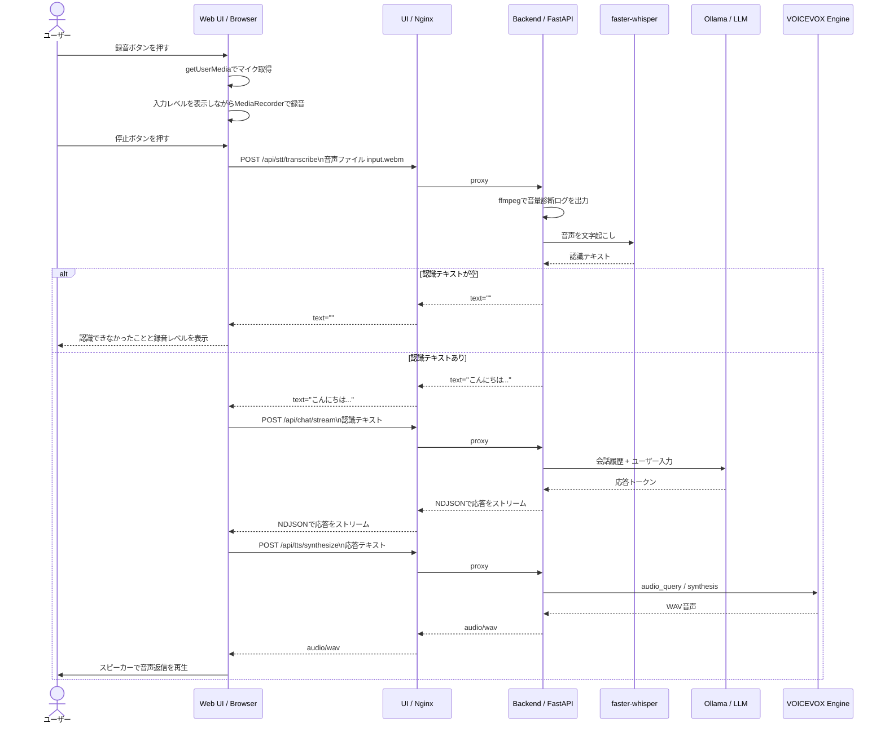

# hello-voice1

OSSベースのローカル音声アシスタントです。

ホスト側に入れるものは、基本的に **GPUを利用できるDocker環境** だけです。Python、Node.js、pnpm、VOICEVOX Engine、Ollama本体はホストに入れず、Docker image / Docker Compose内で扱います。

## 前提

- Docker Desktopが起動している
- DockerでNVIDIA GPUを使える
- Git Bash、PowerShell、cmdのどれでもよいが、手順はDocker CLIを直接実行する

DockerとGPUを確認します。

```bash
docker version
docker compose version
docker run --rm --gpus all nvidia/cuda:12.4.1-base-ubuntu22.04 nvidia-smi
```

`nvidia-smi` にGPUが表示されればOKです。

## 全体構成

ブラウザだけがホスト側で動き、LLM/STT/TTS/Backend/UI配信はDocker Composeで起動します。マイク入力とスピーカー再生はブラウザが担当し、Backendは音声認識、会話制御、音声合成APIの呼び出しをまとめます。

Web UIはBackend APIを同一オリジンの `/api` と `/health` で呼びます。実際の中継はUIコンテナ内のNginxが行うため、スマートフォンからTailscale IPやTailscale ServeのHTTPS URLで開いた場合でも、ブラウザがスマートフォン自身の `127.0.0.1` を見に行くことはありません。



## 音声入力から音声返信まで

音声入力では、ブラウザが録音したWebM/Opus音声をBackendへ送り、Backend内の `faster-whisper` でテキスト化します。そのテキストをOllamaへ送り、返答テキストをVOICEVOXでWAVにして、最後にブラウザが再生します。



## 起動

初回はDocker imageのpullとBackend/UIのbuildが走ります。

```bash
docker compose up --build -d
```

状態を確認します。

```bash
docker compose ps
```

開くURL:

- UI: http://127.0.0.1:1420/
- Backend: http://127.0.0.1:8000
- API docs: http://127.0.0.1:8000/docs
- Docker Ollama: http://127.0.0.1:11435
- VOICEVOX Engine: http://127.0.0.1:50021

## スマートフォンからのアクセス

スマートフォンで音声入力まで使う場合は、Tailscale ServeでWeb UIをHTTPS化して開きます。`tailscale funnel` は使いません。Funnelは外部インターネット公開用なので、この用途では不要です。

PC側でDocker Composeを起動したあと、次を実行します。

```bash
docker compose up --build -d
tailscale serve --bg http://127.0.0.1:1420
tailscale serve status
```

`tailscale serve status` に表示されたHTTPS URLを、Tailscale接続中のスマートフォンで開きます。

```text
https://<machine-name>.<tailnet-name>.ts.net/
```

このURLで開くとブラウザ上はHTTPS扱いになるため、スマートフォンのマイク入力、テキスト入力、LLM応答、VOICEVOXの音声再生を利用できます。

Serve設定を消したい場合:

```bash
tailscale serve reset
```

HTTPのTailscale IPで開くこともできますが、スマートフォンのChrome/Edge/Safariはマイク入力をHTTPSまたはlocalhostのような安全なコンテキストに制限します。そのため、HTTPでは画面表示、テキスト入力、LLM応答、VOICEVOXの音声再生までの利用になります。

## モデル取得

Docker内Ollamaのモデル保存先は初回は空です。少なくとも1つpullしてください。

```bash
docker compose exec ollama ollama pull gemma3:4b
docker compose exec ollama ollama list
```

OllamaがGPUを認識しているか確認します。

```bash
docker compose logs ollama
```

ログ内に `library=CUDA` や `NVIDIA GeForce` が出ていれば、OllamaコンテナからGPUを利用できています。

## 動作確認

各コンポーネントの疎通を確認します。

```bash
curl --fail http://127.0.0.1:11435/api/version
curl --fail http://127.0.0.1:50021/version
curl --fail http://127.0.0.1:8000/health
curl --fail http://127.0.0.1:1420/health
curl --fail --head http://127.0.0.1:1420/
```

TTSを確認します。

```bash
curl --fail \
  --request POST \
  --header "Content-Type: application/json" \
  --data '{"text":"\u3053\u3093\u306b\u3061\u306f\u3002\u97f3\u58f0\u30c6\u30b9\u30c8\u3067\u3059\u3002","provider":"voicevox"}' \
  --output docker-tts-test.wav \
  http://127.0.0.1:8000/api/tts/synthesize
```

STTを確認します。任意の音声ファイルを指定してください。

```bash
curl --fail \
  -F "file=@sample.m4a;type=audio/mp4" \
  http://127.0.0.1:8000/api/stt/transcribe
```

LLM応答を確認します。

```bash
curl --no-buffer \
  --request POST \
  --header "Content-Type: application/json" \
  --data '{"text":"短く自己紹介してください。","model":"gemma3:4b"}' \
  http://127.0.0.1:8000/api/chat/stream
```

## 音声入力の確認

Web UIの設定パネルで `Mic` を選べます。録音中はマイクボタン下の入力レベルメーターが動きます。

Backendログにも音量診断が出ます。

```bash
docker compose logs --tail 80 backend
```

見るポイント:

```text
STT upload received: filename=input.webm ... bytes=...
STT audio stats: ... mean_volume=... max_volume=...
STT result: text_length=... segments=...
```

`mean_volume` が `-90 dB` 前後、`max_volume` が `-70 dB` 前後なら、ほぼ無音です。Web UIの `Mic` 選択、Chromeのマイク権限、Windowsの入力デバイスとミュート設定を確認してください。

## 停止

```bash
docker compose down
```

ログを見る場合:

```bash
docker compose logs -f
docker compose logs -f ollama
docker compose logs -f backend
docker compose logs -f voicevox
```

## Docker版の補足

ホストのOllamaは通常 `11434` を使うため、Docker版Ollamaはホスト側 `11435` に公開しています。Backendコンテナは内部ネットワークで `http://ollama:11434` に接続します。

Docker版のOllamaモデルはDocker volume `hello-voice1_ollama-data` に保存されます。

VOICEVOX Engineは `voicevox/voicevox_engine:cpu-ubuntu20.04-latest` を使います。TTSはCPUで動かし、LLMはOllamaコンテナでGPUを使う構成です。

STTはデフォルトで有効です。Backend imageには `faster-whisper` が入り、設定は `HELLO_VOICE_STT_PROVIDER=faster_whisper` です。WhisperモデルキャッシュはDocker volume `hello-voice1_backend-data` に保存されます。

## データ保存

Docker volumeに保存されます。

- `hello-voice1_ollama-data`: Ollamaモデル
- `hello-voice1_backend-data`: 設定、履歴、Whisperキャッシュ

完全に消したい場合:

```bash
docker compose down -v
```

## 参考

- Ollama Docker: https://docs.ollama.com/docker
- VOICEVOX Engine Docker image: https://hub.docker.com/r/voicevox/voicevox_engine
- VOICEVOX API: https://voicevox.github.io/voicevox_engine/api/
