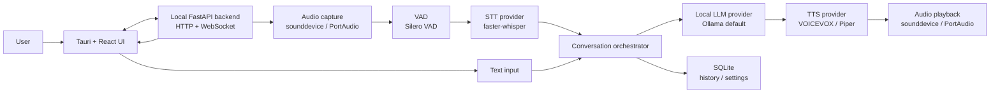

# OSSベース音声アシスタント設計

## 目的

Windows上で先に動かし、Linuxにも移植しやすいローカル音声アシスタントを作る。入力は音声またはテキスト、処理はローカルLLM、出力はTTS音声とテキスト表示にする。

優先する性質:

- OSS中心で構成する
- Windows/Linuxの差分をUIやコアロジックに漏らさない
- STT、LLM、TTSを後から差し替えられる
- 音声処理の遅延とユーザー操作の中断性を重視する
- モデルや音声ライセンスを個別に確認できる構造にする

## 推奨アーキテクチャ

UIはTauri + React、音声/AI処理はPythonのローカルバックエンドとして分離する。



この分離により、UIはデスクトップアプリとして配布しつつ、音声処理はPythonエコシステムの成熟したライブラリを使える。将来、CLI、Web UI、常駐サービスへ展開する場合もFastAPIバックエンドを再利用できる。

## UI設計

メイン画面はチャット型の会話画面にする。ただし、音声アシスタントなので「録音、認識、生成、発話」の状態が一目で分かることを最優先にする。

主要領域:

- 会話タイムライン: ユーザー発話、STT結果、LLM応答、エラーを時系列表示
- 入力バー: テキスト入力、送信、マイク開始/停止
- 音声状態バー: 待機中、聞き取り中、認識中、生成中、発話中、停止中
- 波形/音量メーター: マイク入力とVAD反応を表示
- 中断ボタン: 生成中または発話中の処理を止める
- 設定パネル: 入出力デバイス、STTモデル、LLMモデル、TTS音声、音量、速度、履歴保存

画面状態:

- Standby: テキスト入力とマイクボタンを有効化
- Listening: 音量メーターと録音時間を表示、キャンセル可能
- Transcribing: STT中であることを表示、暫定テキストがあれば表示
- Thinking: LLMのストリーミング応答を表示
- Speaking: TTS再生中、停止と次の入力受付を制御
- Error: 失敗した段階と復旧操作を表示

初期MVPでは常時待ち受けより、クリックまたはホールドで録音するPush-to-talkを採用する。ウェイクワードは誤検出、常時録音、モデル調整の検討が必要なため、後続フェーズに回す。

## ライブラリ選定

### UI

推奨:

- Tauri 2
- React
- TypeScript
- Vite
- ZustandまたはJotai
- TanStack Query

理由:

- Windows/Linux向けデスクトップアプリを構成しやすい
- UIをWeb技術で作れるため、将来Web版やリモート操作画面に転用しやすい
- Pythonバックエンドをローカルサービスまたはsidecarとして扱える

代替:

- PySide6: 最短でMVPを作る場合。PythonだけでUIと音声処理を書けるが、Web UIへの転用は弱い。
- Electron: Web資産は活かしやすいが、Tauriより配布サイズと常駐メモリが大きくなりやすい。

### Backend / API

推奨:

- Python 3.11+
- FastAPI
- Uvicorn
- WebSocket
- Pydantic Settings
- SQLite + SQLModelまたはSQLAlchemy

役割:

- UIからのコマンド受付
- 音声入力セッション管理
- STT、LLM、TTSプロバイダーの呼び出し
- ストリーミングイベント配信
- 会話履歴と設定の保存

### Audio I/O

推奨:

- sounddevice
- numpy
- soundfile

理由:

- sounddeviceはPortAudioバインディングで、Windows/Linux/macOSに対応する
- STT向けのPCM処理、TTS WAV再生、デバイス列挙を同じ層で扱える

### VAD

推奨:

- Silero VAD

用途:

- 無音区間の自動停止
- STTへの不要音声入力削減
- 「話している/止まった」のUI表示

代替:

- WebRTC VAD: 軽量だが調整しづらく、誤検出が増えやすい

### STT

推奨:

- faster-whisper

理由:

- Whisper系モデルをCTranslate2で高速に動かせる
- CPUでもGPUでも運用しやすい
- Pythonバックエンドと統合しやすい
- 日本語を含む多言語入力に対応しやすい

初期設定案:

- モデル: `small`または`medium`
- CPU: `int8`
- GPU: `float16`
- サンプリング: 16 kHz mono PCM
- 言語: 初期値 `ja`、設定でautoも選択可能

代替:

- whisper.cpp: C++実装で配布しやすい。Python依存を減らしたい場合の候補。
- Vosk: 軽量だが、Whisper系より認識品質が要件に合わない可能性がある。

### LLM

推奨:

- Ollama

理由:

- Windows/Linuxで導入しやすい
- モデル管理が簡単
- OpenAI互換APIを使えるため、将来llama.cppなどに差し替えやすい

初期モデル候補:

- 軽量: Qwen系またはLlama系の3Bから8Bクラス
- 日本語重視: 日本語性能の高いGGUF/量子化モデルをOllamaまたはllama.cppで運用

代替:

- llama.cpp / llama-server: 依存をより小さくしたい場合、またはGGUF運用を直接制御したい場合。
- llama-cpp-python server: Python側でOpenAI互換サーバーを立てたい場合。

### TTS

日本語優先の推奨:

- VOICEVOX Engine

理由:

- 日本語読み上げの自然さが高い
- HTTP APIで統合しやすい
- Windows/Linuxで運用しやすく、Docker運用も選べる

注意:

- エンジン、コア、キャラクター/話者、音声ライブラリのライセンスと利用条件を分けて確認する
- 配布形態によって同梱可否や表記義務が変わる可能性がある

軽量/多言語の推奨:

- Piper

理由:

- ローカルで高速に動くニューラルTTS
- ONNXベースで軽い
- 多言語音声を選びやすい

代替:

- Open JTalk: 日本語の完全ローカル軽量TTS。品質は機械的になりやすい。
- Style-Bert-VITS2系: 高品質な日本語音声を狙えるが、モデル管理とライセンス確認が重くなる。

## Providerインターフェイス

各エンジンは直接UIから呼ばず、共通インターフェイスの実装として扱う。

```python
class STTProvider:
    async def transcribe(self, pcm16: bytes, sample_rate: int) -> "Transcript":
        ...

class LLMProvider:
    async def stream_chat(self, messages: list["Message"]) -> "AsyncIterator[TokenEvent]":
        ...

class TTSProvider:
    async def synthesize(self, text: str, voice: str) -> "AudioChunkStream":
        ...
```

バックエンドは `provider_name` と設定値から実装を選ぶ。これにより、MVPではOllama/faster-whisper/VOICEVOXを使い、後からllama.cpp/Piper等へ切り替えられる。

## イベント設計

UIとバックエンドはWebSocketで状態イベントをやり取りする。

イベント例:

- `audio.level`: 音量メーター更新
- `vad.speech_started`
- `vad.speech_ended`
- `stt.partial`
- `stt.final`
- `llm.token`
- `llm.done`
- `tts.started`
- `tts.chunk`
- `tts.done`
- `assistant.cancelled`
- `error`

テキスト入力の場合も、STTをスキップして同じ `ConversationOrchestrator` に流す。

## ディレクトリ構成案

```text
hello-voice1/
  apps/
    desktop/              # Tauri + React
  services/
    assistant-core/        # Python FastAPI backend
      assistant_core/
        api/
        audio/
        providers/
          stt/
          llm/
          tts/
        conversation/
        storage/
        settings/
      tests/
  models/                  # 開発用。配布時はユーザーデータ配下へ
  docs/
    assistant-design.md
```

モデルファイルはGitに含めない。ユーザー環境ではOSごとのアプリデータディレクトリに置く。

## 実行方式

開発時:

- UI: `pnpm dev`
- Backend: `uvicorn assistant_core.main:app --reload`
- LLM: `ollama serve`
- TTS: VOICEVOX EngineまたはPiperをローカル起動

配布時:

- TauriアプリがPythonバックエンドをsidecarとして起動
- Ollama/VOICEVOXは外部依存として検出し、未起動なら案内または起動補助
- 将来的にはPiperやwhisper.cppを同梱候補にする

## MVPスコープ

1. テキスト入力からOllamaへ送信し、応答をストリーミング表示
2. 応答テキストをVOICEVOXまたはPiperで読み上げ
3. Push-to-talk録音
4. faster-whisperでSTT
5. 会話履歴と設定保存
6. 中断ボタンでLLM生成とTTS再生を止める

MVPではウェイクワード、複数エージェント、外部ツール実行、長期記憶、RAGは含めない。

## 次フェーズ

- openWakeWordによるウェイクワード
- ツール実行インターフェイス
- RAGまたはローカルファイル検索
- 会話要約メモリ
- モデルダウンロード管理
- Linuxパッケージング
- GPU/CPU自動ベンチマーク
- ノイズ抑制とエコーキャンセル

## 主なリスク

- TTSの話者ライセンス確認が必要
- GPU利用時のCUDA/DirectML/ROCm差分が大きい
- 常時待ち受けはプライバシー表示と誤検出対策が必要
- WindowsとLinuxで音声デバイス名や排他制御の挙動が異なる
- 大きいモデルを同梱すると配布サイズが現実的でなくなる

## 参照した公式情報

- Tauri prerequisites: https://v2.tauri.app/start/prerequisites/
- FastAPI WebSocket: https://fastapi.tiangolo.com/advanced/websockets/
- sounddevice: https://python-sounddevice.readthedocs.io/
- faster-whisper: https://github.com/SYSTRAN/faster-whisper
- Ollama OpenAI compatibility: https://docs.ollama.com/api/openai-compatibility
- llama-cpp-python server: https://llama-cpp-python.readthedocs.io/en/latest/server/
- Silero VAD: https://github.com/snakers4/silero-vad
- openWakeWord: https://github.com/dscripka/openWakeWord
- VOICEVOX Engine: https://github.com/VOICEVOX/voicevox_engine
- VOICEVOX API: https://voicevox.github.io/voicevox_engine/api/
- Piper: https://github.com/rhasspy/piper
